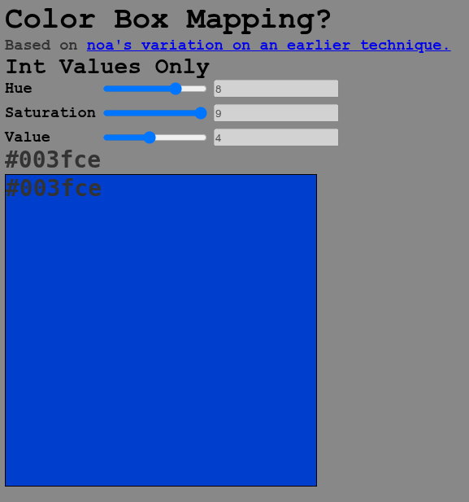
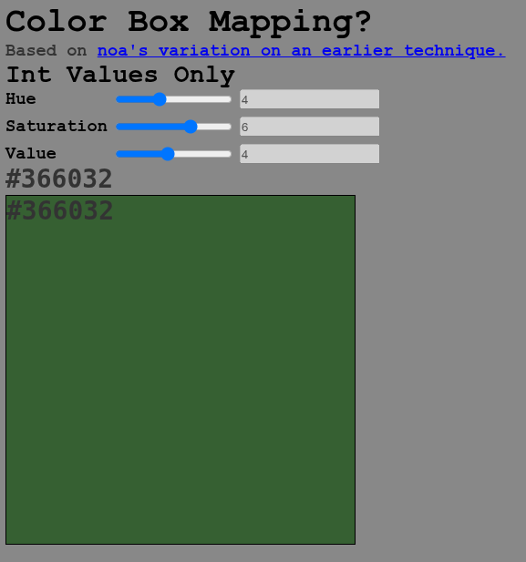

# noacolormapper

Riffs on the color format described on [noacubestudio][]'s blog.

Sliders allow stepping through the color values:

<table>
    <tr>
        <td></img></td>
        <td></img></td>
    </tr>
</table>

Currently features 1200 discrete precalculated colors:

- 12 hue steps
- 10 saturation steps
- 10 value steps

The color values in [`new.js`](new.js) are cleaned up from
those listed in the inspiring [blog post][noacubestudio].

[noacubestudio]: https://noacubestudio.github.io/blog.html
